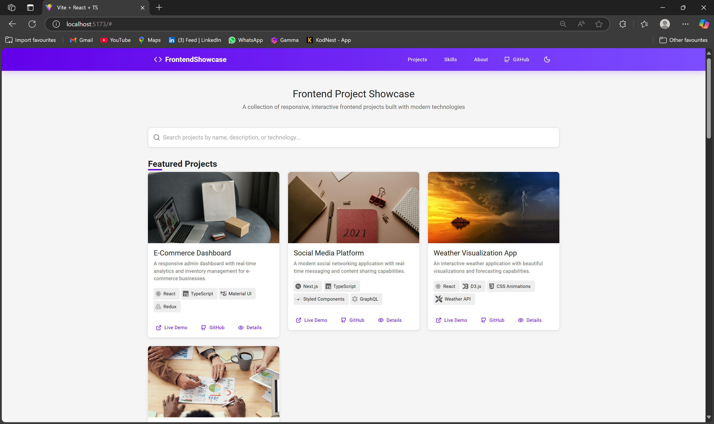
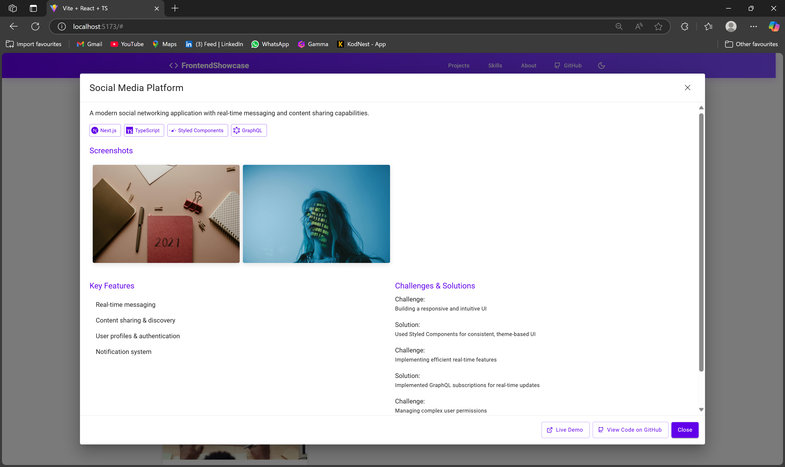

# Frontend Technologies Showcase

A portfolio application that showcases frontend projects in a visually engaging way, built with React and TypeScript.




## Features

- **Project Showcase Section**: Display frontend projects in a responsive grid with details
- **Project Details Page**: View in-depth information about each project
- **Skill Visualization**: Interactive radar chart showing frontend skills
- **Interactive Component Demo**: Live component with code snippets
- **Search Functionality**: Filter projects by title, description, and technologies

## Tech Stack

- **Frontend**:

  - React + TypeScript
  - Material-UI (MUI) for UI components
  - Styled Components for custom styling
  - Framer Motion for animations
  - Chart.js for data visualization
  - React Syntax Highlighter for code display

- **Data**:
  - Mock data (simulated API responses)

## Getting Started

### Prerequisites

- Node.js (v14 or higher)
- npm or yarn

### Installation

1. Clone the repository:

   ```bash
   git clone https://github.com/yourusername/frontend-showcase.git
   cd frontend-showcase
   ```

2. Install dependencies:

   ```bash
   npm install
   # or
   yarn install
   ```

3. Start the development server:

   ```bash
   npm run dev
   # or
   yarn dev
   ```

4. Open your browser and navigate to `http://localhost:5173`

## Project Structure

```
frontend-showcase/
  ├── src/
  │   ├── components/       # Reusable UI components
  │   ├── types/            # TypeScript type definitions
  │   ├── data/             # Mock data
  │   ├── theme/            # MUI theme configuration
  │   ├── App.tsx           # Main application component
  │   └── main.tsx          # Entry point
  ├── package.json
  └── tsconfig.json
```

## Core Components

- **ProjectCard**: Displays project summary with image, title, description, and tech stack
- **ProjectDetails**: Shows in-depth project information, features, and challenges
- **SkillRadarChart**: Visualizes frontend skills proficiency
- **InteractiveDemo**: Showcases a custom component with live interaction and code preview

## Validation Criteria

- **UI/UX**:

  - Clean and responsive layout
  - Smooth animations and transitions
  - Consistent design language

- **Frontend Showcase**:

  - Clear presentation of project details
  - Interactive demo functionality
  - Proper visualization of skills

- **Code Quality**:
  - Strong TypeScript typing
  - Well-structured component architecture
  - Reusable components and hooks
